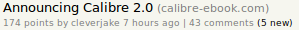

HN+
===

A simple extension for Chrome and FF adding "x new comments" to visited Hacker News entries  

Uses [Mozilla's localForage](http://mozilla.github.io/localForage) library.  
Just an excuse to play around with reusing code cross browser. Both Chrome and FF use the same 'inject.js'
